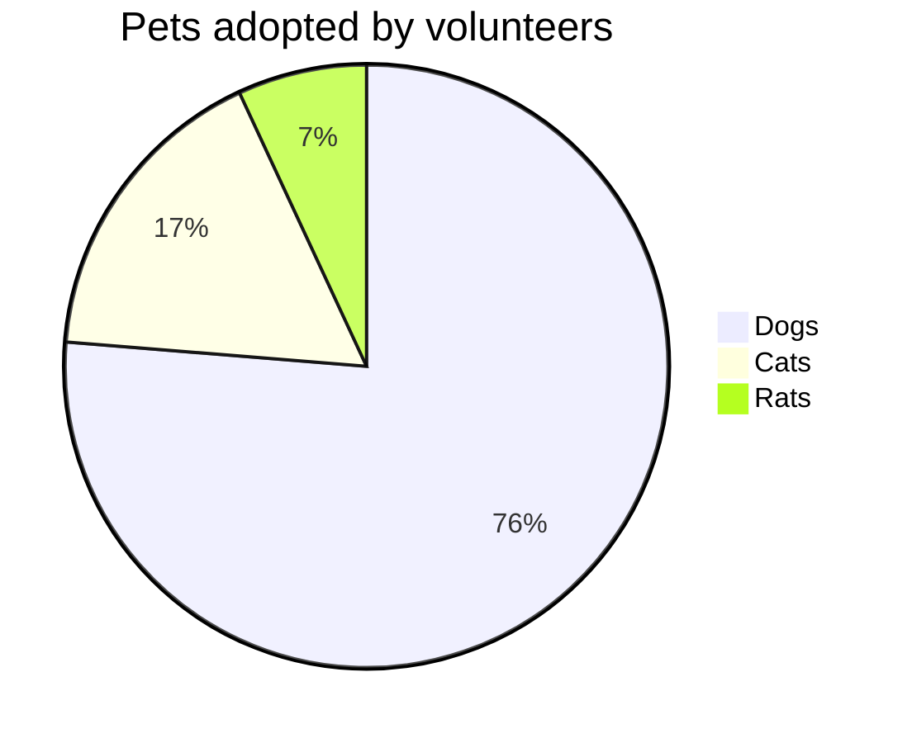

# Test

```mermaid
graph TD;
	A-->B;
	A-->C;
	B-->D;
	C-->D;
```

!

```mermaid!
graph TD;
	A-->B;
	A-->C;
	B-->D;
	C-->D;
```

```mermaid!
pie title Pets adopted by volunteers
  "Dogs" : 386
  "Cats" : 85
  "Rats" : 35
```
